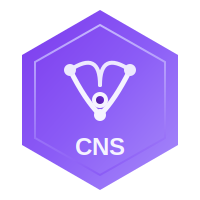

# CNS - Chiral Narrative Synthesis

<p align="center">
  
</p>

<p align="center">
  <strong>Dialectical Reasoning Framework for Automated Knowledge Discovery</strong>
</p>

<p align="center">
  <a href="https://github.com/North-Shore-AI/cns/actions"></a>
  <a href="https://hex.pm/packages/cns"></a>
  <a href="https://hexdocs.pm/cns"></a>
  <a href="LICENSE"></a>
</p>

---

## Overview

CNS (Chiral Narrative Synthesis) is an Elixir library implementing a novel three-agent dialectical reasoning system for automated knowledge discovery and claim synthesis. Inspired by Hegelian dialectics, CNS transforms conflicting claims into coherent, evidence-grounded narratives through a structured thesis-antithesis-synthesis pipeline.

### Key Concepts

- **Structured Narrative Objects (SNOs)**: Rich data structures capturing claims, evidence, confidence scores, and provenance chains
- **Three-Agent Pipeline**: Proposer, Antagonist, and Synthesizer agents work in concert to refine knowledge
- **Evidence Grounding**: All claims are anchored to verifiable sources with citation validity scoring
- **Convergence Guarantees**: Mathematical foundations ensure the dialectical process terminates with coherent output

## Features

- **Claim Extraction**: Extract structured claims from unstructured text with confidence scoring
- **Dialectical Synthesis**: Automated thesis-antithesis-synthesis reasoning cycles
- **Evidence Grounding**: Link claims to verifiable sources with validity scores
- **Multi-Model Support**: Integrate with various LLM backends via Crucible
- **LoRA Training Integration**: Fine-tune models for domain-specific dialectics via Tinkex
- **Observable Pipeline**: Full telemetry and tracing for research and debugging
- **Convergence Metrics**: Track synthesis quality and dialectical progress

## Installation

Add `cns` to your list of dependencies in `mix.exs`:

```elixir
def deps do
  [
    {:cns, "~> 0.1.0"}
  ]
end
```

Then run:

```bash
mix deps.get
```

## Quick Start

### Basic Claim Synthesis

```elixir
# Define conflicting claims
thesis = %CNS.SNO{
  claim: "Remote work increases productivity",
  evidence: [
    %CNS.Evidence{source: "Stanford Study 2023", validity: 0.85}
  ],
  confidence: 0.75
}

antithesis = %CNS.SNO{
  claim: "Remote work decreases collaboration",
  evidence: [
    %CNS.Evidence{source: "Microsoft Research 2023", validity: 0.82}
  ],
  confidence: 0.70
}

# Run dialectical synthesis
{:ok, synthesis} = CNS.synthesize(thesis, antithesis)

IO.puts(synthesis.claim)
# => "Remote work increases individual productivity while requiring
#     intentional collaboration structures to maintain team effectiveness"
```

### Using the Three-Agent Pipeline

```elixir
# Initialize the pipeline with configuration
config = %CNS.Config{
  proposer: %{model: "gpt-4", temperature: 0.7},
  antagonist: %{model: "gpt-4", temperature: 0.8},
  synthesizer: %{model: "gpt-4", temperature: 0.3},
  max_iterations: 5,
  convergence_threshold: 0.85
}

# Process a research question
{:ok, result} = CNS.Pipeline.run(
  "What are the effects of caffeine on cognitive performance?",
  config
)

# Access the synthesized knowledge
IO.inspect(result.final_synthesis)
IO.inspect(result.evidence_chain)
IO.inspect(result.convergence_score)
```

### Claim Extraction from Text

```elixir
text = """
Recent studies suggest that intermittent fasting may improve metabolic health.
However, some researchers caution that the long-term effects are not well understood.
"""

{:ok, claims} = CNS.Proposer.extract_claims(text)

Enum.each(claims, fn claim ->
  IO.puts("Claim: #{claim.claim}")
  IO.puts("Confidence: #{claim.confidence}")
  IO.puts("---")
end)
```

## Architecture

CNS implements a three-agent dialectical reasoning system:

```
                    +-------------+
                    |  Proposer   |
                    | (Thesis)    |
                    +------+------+
                           |
                           v
                    +-------------+
                    | Antagonist  |
                    | (Antithesis)|
                    +------+------+
                           |
                           v
                    +-------------+
                    | Synthesizer |
                    | (Synthesis) |
                    +------+------+
                           |
                    +------v------+
                    | Convergence |
                    |   Check     |
                    +-------------+
                           |
              +------------+------------+
              |                         |
         Converged?                Not Converged
              |                         |
              v                         v
        Final SNO              Feed back to Proposer
```

### Core Components

1. **CNS.Proposer**: Generates initial claims and hypotheses from input data
2. **CNS.Antagonist**: Challenges claims with counter-evidence and alternative interpretations
3. **CNS.Synthesizer**: Reconciles conflicting claims into coherent, nuanced narratives
4. **CNS.SNO**: Structured Narrative Object - the core data structure for claims
5. **CNS.Evidence**: Evidence records with source attribution and validity scores
6. **CNS.Pipeline**: Orchestrates the full dialectical reasoning cycle

### Integration Points

- **Crucible Framework**: Use Crucible's ensemble and hedging for reliable LLM calls
- **Tinkex**: Train custom LoRA adapters for domain-specific dialectics
- **ExDataCheck**: Validate input data quality before processing
- **LlmGuard**: Protect against adversarial inputs and prompt injection

## Configuration

```elixir
# config/config.exs
config :cns,
  default_model: "gpt-4",
  max_iterations: 5,
  convergence_threshold: 0.85,
  evidence_validation: true,
  telemetry_enabled: true

# Model-specific settings
config :cns, CNS.Proposer,
  temperature: 0.7,
  max_tokens: 2000

config :cns, CNS.Antagonist,
  temperature: 0.8,
  max_tokens: 2000,
  critique_depth: :thorough

config :cns, CNS.Synthesizer,
  temperature: 0.3,
  max_tokens: 3000,
  citation_validity_weight: 0.4
```

## Documentation

- [Architecture Guide](docs/20251121/architecture.md) - System design and theoretical foundations
- [API Reference](docs/20251121/api_reference.md) - Complete module and function documentation
- [Training Guide](docs/20251121/training_guide.md) - LoRA fine-tuning via Tinkex
- [Getting Started](docs/20251121/getting_started.md) - Tutorial for new users

## Development

### Prerequisites

- Elixir 1.14+
- OTP 25+
- Mix build tool

### Setup

```bash
# Clone the repository
git clone https://github.com/North-Shore-AI/cns.git
cd cns

# Install dependencies
mix deps.get

# Run tests
mix test

# Run tests with coverage
mix test --cover

# Generate documentation
mix docs

# Run static analysis
mix dialyzer
```

### Testing

```bash
# Run all tests
mix test

# Run specific test file
mix test test/cns/synthesizer_test.exs

# Run with verbose output
mix test --trace

# Run property-based tests
mix test --only property
```

## Contributing

We welcome contributions! Please see our contribution guidelines:

1. Fork the repository
2. Create a feature branch (`git checkout -b feature/amazing-feature`)
3. Write tests for your changes
4. Ensure all tests pass (`mix test`)
5. Run the formatter (`mix format`)
6. Run dialyzer (`mix dialyzer`)
7. Commit your changes (`git commit -m 'Add amazing feature'`)
8. Push to the branch (`git push origin feature/amazing-feature`)
9. Open a Pull Request

### Code Standards

- Follow the [Elixir Style Guide](https://github.com/christopheradams/elixir_style_guide)
- Maintain >90% test coverage
- Document all public functions with `@doc` and `@spec`
- Zero compilation warnings
- All new features must include tests

## Research Foundation

CNS is based on research in:

- Dialectical reasoning and Hegelian synthesis
- Multi-agent debate systems for AI alignment
- Evidence-grounded natural language inference
- Claim verification and fact-checking

Key theoretical contributions:
- **Convergence Theorem**: Proof that the dialectical process terminates
- **Synthesis Quality Bounds**: Theoretical guarantees on output coherence
- **Evidence Chain Validity**: Formal model for citation trustworthiness

## License

Copyright 2025 North-Shore-AI

Licensed under the Apache License, Version 2.0 (the "License");
you may not use this file except in compliance with the License.
You may obtain a copy of the License at

    http://www.apache.org/licenses/LICENSE-2.0

Unless required by applicable law or agreed to in writing, software
distributed under the License is distributed on an "AS IS" BASIS,
WITHOUT WARRANTIES OR CONDITIONS OF ANY KIND, either express or implied.
See the License for the specific language governing permissions and
limitations under the License.

## Acknowledgments

- North-Shore-AI organization for infrastructure and support
- Crucible Framework for reliable LLM orchestration
- Tinkex for LoRA training capabilities
- The Elixir community for excellent tooling

---

<p align="center">
  Made with dialectical reasoning by <a href="https://github.com/North-Shore-AI">North-Shore-AI</a>
</p>
