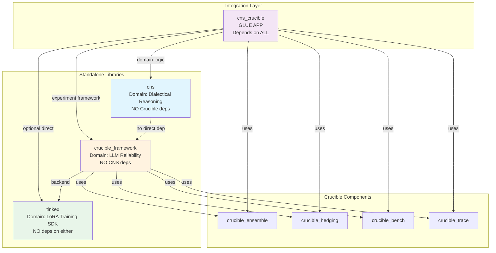

# CNS-Crucible Dependency Architecture

**Date:** 2025-11-25
**Status:** Current Architecture Analysis

---

## Executive Summary

The CNS-Crucible integration uses a **clean separation** architecture with an intermediate **glue app** (`cns_crucible`) to bridge the two frameworks. This keeps both CNS and Crucible framework independent and reusable.

---

## Dependency Graph



---

## Actual Dependencies (from mix.exs)

### 1. CNS (cns/mix.exs)

```elixir
deps: [
  {:nx, "~> 0.7"},
  {:jason, "~> 1.4"},
  {:nimble_parsec, "~> 1.4"},
  {:uuid, "~> 1.1"},
  {:libgraph, "~> 0.16"},
  {:telemetry, "~> 1.2"},
  {:ex_topology, "~> 0.1.1"},
  {:bumblebee, "~> 0.5", optional: true},
  {:exla, "~> 0.7", optional: true}
]
```

**Key Point:** ❌ **NO Crucible dependency**
**Key Point:** ❌ **NO Tinkex dependency**

CNS is a **standalone library** for dialectical reasoning that can be used independently.

### 2. Crucible Framework (crucible_framework/mix.exs)

```elixir
deps: [
  # Component Libraries
  {:crucible_ensemble, path: "../crucible_ensemble"},
  {:crucible_hedging, path: "../crucible_hedging"},
  {:crucible_bench, path: "../crucible_bench"},
  {:crucible_trace, path: "../crucible_trace"},

  # Backend Integration
  {:tinkex, "~> 0.1.2"},

  # Core Dependencies
  {:ecto_sql, "~> 3.11"},
  {:postgrex, ">= 0.0.0"},
  {:jason, "~> 1.4"},
  {:telemetry, "~> 1.2"},
  {:nx, "~> 0.7"}
]
```

**Key Point:** ❌ **NO CNS dependency**

Crucible Framework defines a **behaviour** (`Crucible.CNS.Adapter`) but doesn't depend on the CNS library.

### 3. CNS Experiments (cns_crucible/mix.exs)

```elixir
deps: [
  # Core dependencies - the three pillars
  {:cns, path: "../cns"},
  {:crucible_framework, path: "../crucible_framework"},
  {:tinkex, path: "../tinkex", override: true},
  {:crucible_ensemble, path: "../crucible_ensemble"},
  {:crucible_hedging, path: "../crucible_hedging"},
  {:crucible_bench, path: "../crucible_bench"},
  {:crucible_trace, path: "../crucible_trace"},

  # ML stack for CNS experiments
  {:bumblebee, "~> 0.5"},
  {:exla, "~> 0.7"},
  {:nx, "~> 0.7"},
  {:axon, "~> 0.6"}
]
```

**Key Point:** ✅ **Depends on BOTH CNS and Crucible**
**Key Point:** ✅ **Brings everything together**

This is the **integration app** that wires CNS domain logic into Crucible's experiment framework.

---

## Architecture Pattern: Adapter + Glue App

### Why This Pattern?

**Problem:** We want to use CNS with Crucible, but:
1. CNS should be usable standalone (e.g., in web apps, other frameworks)
2. Crucible should be domain-agnostic (not tied to CNS specifically)
3. We need concrete wiring between them

**Solution:** Adapter pattern + intermediate glue app

```
┌─────────────────────────────────────────────────────────────┐
│                    cns_crucible                          │
│  (Integration Layer - Knows about both domains)             │
│                                                              │
│  ┌──────────────────────────────────────────────────────┐  │
│  │  CnsExperiments.Adapters.Metrics                     │  │
│  │    implements Crucible.CNS.Adapter                   │  │
│  │    calls CNS.Topology, CNS.Metrics, etc.             │  │
│  └──────────────────────────────────────────────────────┘  │
│                                                              │
│  ┌──────────────────────────────────────────────────────┐  │
│  │  CnsExperiments.Experiments.ScifactClaimExtraction   │  │
│  │    uses Crucible IR to define experiments            │  │
│  │    uses CNS for validation                           │  │
│  └──────────────────────────────────────────────────────┘  │
└─────────────────────────────────────────────────────────────┘
                            │
        ┌───────────────────┴───────────────────┐
        │                                       │
        ▼                                       ▼
┌───────────────────┐                  ┌───────────────────┐
│       cns         │                  │ crucible_framework│
│  (Domain Logic)   │                  │ (Experiment Infra)│
│                   │                  │                   │
│ CNS.Topology      │                  │ Crucible.Stage    │
│ CNS.Metrics       │                  │ Crucible.Backend  │
│ CNS.Agents.*      │                  │ Crucible.CNS      │
│                   │                  │   .Adapter (bhvr) │
└───────────────────┘                  └───────────────────┘
```

---

## Why NOT Put CNS Adapters in CNS Library?

### Option A: CNS depends on Crucible ❌

```elixir
# In cns/mix.exs
deps: [
  {:crucible_framework, "~> 0.3"}  # ❌ BAD
]
```

**Problems:**
1. CNS can't be used standalone without Crucible
2. Circular dependency risk (if Crucible wanted CNS features)
3. Forces users to install Crucible even if not using it
4. Couples CNS release cycle to Crucible's

### Option B: Crucible depends on CNS ❌

```elixir
# In crucible_framework/mix.exs
deps: [
  {:cns, "~> 0.1"}  # ❌ BAD
]
```

**Problems:**
1. Crucible becomes CNS-specific (can't use with other domains)
2. Forces all Crucible users to install CNS
3. Tight coupling - CNS changes break Crucible
4. Violates single responsibility principle

### Option C: Separate Integration App ✅

```elixir
# In cns_crucible/mix.exs
deps: [
  {:cns, path: "../cns"},
  {:crucible_framework, path: "../crucible_framework"}
]
```

**Advantages:**
1. ✅ CNS remains standalone
2. ✅ Crucible remains domain-agnostic
3. ✅ Clean separation of concerns
4. ✅ Can have multiple integration apps (e.g., `bio_experiments`, `finance_experiments`)
5. ✅ Independent release cycles
6. ✅ Easy to test integration without affecting either library

---

## What Lives Where?

### CNS Library (cns/)

**Purpose:** Domain logic for dialectical reasoning

```
lib/cns/
├── agents/              # Proposer, Antagonist, Synthesizer
├── topology/            # Topological analysis
├── metrics/             # Chirality, entanglement
├── validation/          # Semantic validation
└── training/            # Dataset preparation
```

**What it exports:**
- Public API: `CNS.extract_claims/2`, `CNS.synthesize/3`
- Domain types: `CNS.SNO`, `CNS.Evidence`
- Metrics: `CNS.Metrics.chirality/2`
- Validation: `CNS.Validation.Semantic`

**What it does NOT have:**
- ❌ Crucible stages
- ❌ Experiment definitions
- ❌ Crucible.CNS.Adapter implementations

### Crucible Framework (crucible_framework/)

**Purpose:** Generic experiment infrastructure for LLM reliability

```
lib/crucible/
├── stage/               # Pipeline stages (generic)
├── backend/             # Backend adapters (Tinkex, etc.)
├── cns/                 # CNS integration point
│   ├── adapter.ex       # Behaviour definition
│   └── noop.ex          # Default noop implementation
└── experiment/          # Experiment IR
```

**What it exports:**
- Infrastructure: `Crucible.Stage`, `Crucible.Pipeline`
- Behaviours: `Crucible.CNS.Adapter` (behaviour only!)
- Integration points: Plugin system for domain logic

**What it does NOT have:**
- ❌ CNS domain logic
- ❌ Concrete CNS adapter implementations
- ❌ CNS-specific experiments

### CNS Experiments (cns_crucible/)

**Purpose:** Wire CNS domain logic into Crucible infrastructure

```
lib/cns_crucible/
├── adapters/
│   ├── metrics.ex       # Crucible.CNS.Adapter impl
│   ├── surrogates.ex    # Surrogate adapter
│   └── tda.ex           # Full TDA adapter
├── experiments/
│   ├── scifact_claim_extraction.ex
│   └── claim_verification.ex
├── pipelines/
│   └── scifact_validation.ex
└── data/
    └── scifact_loader.ex
```

**What it exports:**
- Adapters: `CnsExperiments.Adapters.Metrics`
- Experiments: `CnsExperiments.Experiments.ScifactClaimExtraction`
- Data loaders: `CnsExperiments.Data.ScifactLoader`

**What it connects:**
- Calls `CNS.Topology.Surrogates.compute_beta1_surrogate/1`
- Calls `CNS.Metrics.chirality/2`
- Calls `Crucible.Pipeline.run/2`
- Implements `Crucible.CNS.Adapter` behaviour

---

## Usage Patterns

### Pattern 1: Using CNS Standalone

```elixir
# In any Elixir app (no Crucible needed)
defp deps do
  [
    {:cns, "~> 0.1"}
  ]
end

# Usage
{:ok, claims} = CNS.extract_claims(text)
{:ok, synthesis} = CNS.synthesize(thesis, antithesis)
chirality = CNS.Metrics.chirality(claim_a, claim_b)
```

### Pattern 2: Using Crucible for Non-CNS Experiments

```elixir
# In any domain experiment app (no CNS needed)
defp deps do
  [
    {:crucible_framework, "~> 0.3"}
  ]
end

# Define experiments using Crucible IR
experiment = %Experiment{
  id: "my_experiment",
  pipeline: [
    %StageDef{name: :data_load},
    %StageDef{name: :backend_call},
    %StageDef{name: :bench}
  ]
}
```

### Pattern 3: Using CNS WITH Crucible

```elixir
# In cns_crucible app
defp deps do
  [
    {:cns, path: "../cns"},
    {:crucible_framework, path: "../crucible_framework"}
  ]
end

# Run CNS experiments via Crucible
CnsExperiments.Experiments.ScifactClaimExtraction.run(
  batch_size: 4,
  limit: 100
)
```

---

## Why You Might NOT Be Using cns_crucible

Looking at the current work (Gate 1 validation script), we're using:

**Location:** `S:\crucible_framework\scripts\validate_surrogates.exs`

This script is in `crucible_framework` but tries to use CNS directly:

```elixir
# Line 9
Code.append_path("../cns/_build/dev/lib/cns/ebin")

# Line 196
CNS.Topology.Surrogates.compute_surrogates(example)
```

### The Issue

This creates a **ad-hoc integration** rather than using the proper glue app. This approach:

1. ✅ Works for quick scripts
2. ✅ Avoids extra dependency
3. ❌ Bypasses the adapter layer
4. ❌ Not how production experiments should run

### The Better Approach

**Option A:** Move validation script to `cns_crucible/`:

```elixir
# cns_crucible/scripts/validate_surrogates.exs
alias CnsExperiments.Adapters.Surrogates
alias CnsExperiments.Data.ScifactLoader

# Uses proper adapters
ScifactLoader.load()
|> Surrogates.compute_and_validate()
```

**Option B:** Use the existing experiment infrastructure:

```elixir
# Run via cns_crucible
mix run -e "CnsExperiments.Experiments.SurrogateValidation.run()"
```

---

## Recommendation

### For Gate 1 Validation

**Keep the current script** in `crucible_framework/scripts/` because:
1. ✅ It's a one-time validation, not a recurring experiment
2. ✅ Quick and self-contained
3. ✅ Documents the validation methodology

### For Production Experiments

**Use cns_crucible** for:
1. Recurring experiments (SciFact claim extraction)
2. Production training pipelines
3. Research studies with full Crucible features (ensemble, hedging, bench)
4. Experiments that need structured experiment IR

### For One-Off Scripts

**Direct CNS usage** is fine for:
1. Data analysis scripts
2. Quick validation checks
3. Prototyping new metrics
4. Development testing

---

## Migration Path

If we want to move the validation to `cns_crucible`:

### Step 1: Create Experiment Module

```elixir
# cns_crucible/lib/cns_crucible/experiments/surrogate_validation.ex
defmodule CnsExperiments.Experiments.SurrogateValidation do
  @moduledoc """
  Gate 1 validation: Test correlation between surrogates and logical validity.
  """

  def run(opts \\ []) do
    experiment = build_experiment(opts)
    CrucibleFramework.run(experiment)
  end

  defp build_experiment(opts) do
    %Experiment{
      id: "surrogate_validation_gate1",
      dataset: %DatasetRef{name: "scifact_claim_extractor"},
      pipeline: [
        %StageDef{name: :data_load},
        %StageDef{name: :cns_surrogate_validation},
        %StageDef{name: :correlation_analysis},
        %StageDef{name: :gate_decision},
        %StageDef{name: :report}
      ]
    }
  end
end
```

### Step 2: Run via Mix Task

```bash
cd cns_crucible
mix cns.validate_surrogates --dataset scifact
```

---

## Summary

### Dependency Architecture

```
cns (standalone) + crucible_framework (standalone)
                    ↓
            cns_crucible (glue)
                    ↓
            Production experiments
```

### Why This Pattern?

1. **Modularity** - Each library can be used independently
2. **Testability** - Can test integration without coupling
3. **Reusability** - CNS can be used in web apps, Crucible in other domains
4. **Maintainability** - Clear boundaries, independent releases
5. **Extensibility** - Easy to add new integration apps

### Current State

- ✅ CNS is standalone
- ✅ Crucible is standalone
- ✅ cns_crucible exists and has proper adapters
- ⚠️ Gate 1 validation script is in crucible_framework (acceptable for one-off)
- 📋 Future experiments should use cns_crucible

---

**Document Version:** 1.0
**Last Updated:** 2025-11-25
**Related:** 20251125_STATUS_REPORT.md, 20251123_CNS_CRUCIBLE_INTEGRATION_SUMMARY.md
